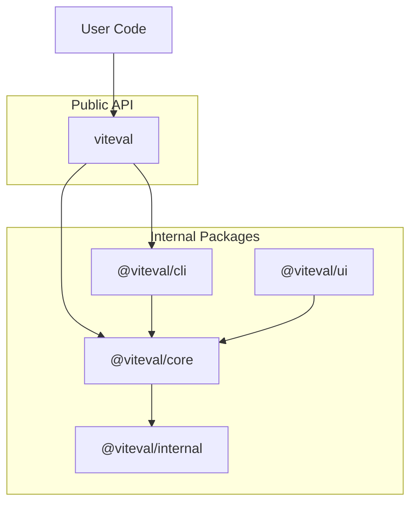

# Architecture

How Viteval packages are structured and work together.

## Overview

Viteval is composed of multiple packages that work together to provide a unified API. The `viteval` package is the main entry point for users, re-exporting everything from internal packages.



## Package Responsibilities

### viteval (main package)

The unified entry point. Users install this single package and get everything they need.

```ts
// User imports from viteval
import { evaluate, createScorer, defineDataset } from 'viteval'
```

Re-exports from `@viteval/core` and includes the CLI binary.

### @viteval/core

The evaluation engine. Provides:

- `evaluate()` - Run evaluation suites
- `createScorer()` - Define custom scoring functions
- `defineDataset()` - Create reusable datasets
- `defineConfig()` - Configuration helpers
- Built-in scorers and reporters

### @viteval/cli

Command-line interface built on Vitest. Provides:

- `viteval run` - Execute evaluations
- `viteval init` - Initialize projects
- `viteval data` - Manage datasets

### @viteval/ui

Web interface for viewing results. React-based dashboard for exploring evaluation results, datasets, and metrics.

### @viteval/internal

Shared utilities used across packages. Type guards, helpers, and common types. Not published for external use.

## Built on Vitest

Evaluations run as Vitest test suites, leveraging its speed, parallelization, and ecosystem.
