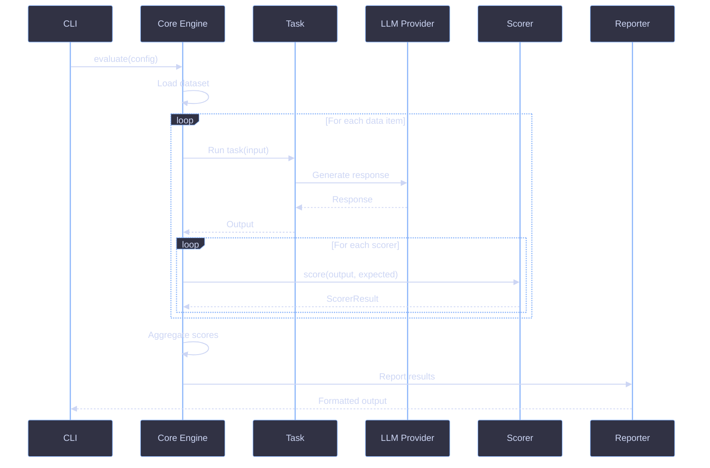

# Architecture

How Viteval packages are structured and work together.

## Overview

Viteval is composed of multiple packages that work together to provide a unified API. The `viteval` package is the main entry point for users, re-exporting everything from internal packages.


```mermaid
%%{init: {
  'theme': 'base',
  'themeVariables': {
    'primaryColor': '#313244',
    'primaryTextColor': '#cdd6f4',
    'primaryBorderColor': '#6c7086',
    'lineColor': '#89b4fa',
    'secondaryColor': '#45475a',
    'tertiaryColor': '#1e1e2e',
    'background': '#1e1e2e',
    'mainBkg': '#313244',
    'clusterBkg': '#1e1e2e',
    'clusterBorder': '#45475a'
  },
  'flowchart': { 'curve': 'basis', 'padding': 15 }
}}%%
flowchart TB
    User(["User Code"])

    subgraph public [" "]
        viteval(["viteval"])
    end

    subgraph internal ["Internal Packages"]
        core(["@viteval/core"])
        cli(["@viteval/cli"])
        ui(["@viteval/ui"])
        int(["@viteval/internal"])
    end

    User --> viteval
    viteval --> core
    viteval --> cli
    core --> int
    cli --> core
    ui --> core

    style public fill:none,stroke:#a6e3a1,stroke-width:2px,stroke-dasharray:5 5
    style internal fill:#181825,stroke:#89b4fa,stroke-width:2px

    classDef external fill:#313244,stroke:#f5c2e7,stroke-width:2px,color:#cdd6f4
    classDef core fill:#313244,stroke:#89b4fa,stroke-width:2px,color:#cdd6f4
    classDef public fill:#313244,stroke:#a6e3a1,stroke-width:2px,color:#cdd6f4

    class User external
    class viteval public
    class core,cli,ui,int core
```

## Package Responsibilities

| Package             | Purpose                                         |
| ------------------- | ----------------------------------------------- |
| `viteval`           | Main package, re-exports core + CLI binary      |
| `@viteval/core`     | Evaluation engine (evaluate, scorers, datasets) |
| `@viteval/cli`      | Command-line interface                          |
| `@viteval/ui`       | Web UI for viewing results                      |
| `@viteval/internal` | Shared utilities (internal only)                |

### viteval (main package)

The unified entry point. Users install this single package and get everything they need.

```ts
import { evaluate, createScorer, defineDataset } from 'viteval';
```

Re-exports from `@viteval/core` and includes the CLI binary.

### @viteval/core

The evaluation engine. Provides:

- `evaluate()` - Run evaluation suites
- `createScorer()` - Define custom scoring functions
- `defineDataset()` - Create reusable datasets
- `defineConfig()` - Configuration helpers
- Built-in scorers and reporters

### @viteval/cli

Command-line interface built on Vitest. Provides:

- `viteval run` - Execute evaluations
- `viteval init` - Initialize projects
- `viteval data` - Manage datasets

### @viteval/ui

Web interface for viewing results. React-based dashboard for exploring evaluation results, datasets, and metrics.

### @viteval/internal

Shared utilities used across packages. Type guards, helpers, and common types. Not published for external use.

---

## Data Flow

How data moves through the evaluation system:


```mermaid
%%{init: {
  'theme': 'base',
  'themeVariables': {
    'primaryColor': '#313244',
    'primaryTextColor': '#cdd6f4',
    'primaryBorderColor': '#6c7086',
    'lineColor': '#89b4fa',
    'secondaryColor': '#45475a',
    'tertiaryColor': '#1e1e2e',
    'background': '#1e1e2e',
    'mainBkg': '#313244',
    'clusterBkg': '#1e1e2e',
    'clusterBorder': '#45475a'
  },
  'flowchart': { 'curve': 'basis', 'padding': 15 }
}}%%
flowchart LR
    subgraph input [" "]
        Dataset(["Dataset"])
        Config(["Config"])
    end

    subgraph processing ["Evaluation Engine"]
        Task(["Task Runner"])
        Scorer(["Scorers"])
        Aggregator(["Aggregator"])
    end

    subgraph output [" "]
        Reporter(["Reporter"])
        Results[("Results")]
    end

    Dataset --> Task
    Config --> Task
    Task --> Scorer
    Scorer --> Aggregator
    Aggregator --> Reporter
    Aggregator --> Results

    style input fill:none,stroke:#f5c2e7,stroke-width:2px,stroke-dasharray:5 5
    style processing fill:#181825,stroke:#89b4fa,stroke-width:2px
    style output fill:none,stroke:#a6e3a1,stroke-width:2px,stroke-dasharray:5 5

    classDef external fill:#313244,stroke:#f5c2e7,stroke-width:2px,color:#cdd6f4
    classDef core fill:#313244,stroke:#89b4fa,stroke-width:2px,color:#cdd6f4
    classDef output fill:#313244,stroke:#a6e3a1,stroke-width:2px,color:#cdd6f4
    classDef storage fill:#45475a,stroke:#a6e3a1,stroke-width:2px,color:#cdd6f4

    class Dataset,Config external
    class Task,Scorer,Aggregator core
    class Reporter output
    class Results storage
```

**The flow:**

1. **Dataset** provides test cases (input/expected pairs)
2. **Config** defines evaluation settings
3. **Task Runner** executes the task function for each input
4. **Scorers** evaluate outputs against expectations
5. **Aggregator** combines individual scores into metrics
6. **Reporter** formats and outputs results
7. **Results** stored for analysis

---

## Evaluation Lifecycle

Sequence of operations during an evaluation run:


```mermaid
%%{init: {
  'theme': 'base',
  'themeVariables': {
    'primaryColor': '#313244',
    'primaryTextColor': '#cdd6f4',
    'primaryBorderColor': '#6c7086',
    'lineColor': '#89b4fa',
    'secondaryColor': '#45475a',
    'tertiaryColor': '#1e1e2e',
    'actorBkg': '#313244',
    'actorBorder': '#89b4fa',
    'actorTextColor': '#cdd6f4',
    'signalColor': '#cdd6f4',
    'signalTextColor': '#cdd6f4'
  }
}}%%
sequenceDiagram
    participant CLI
    participant Core as Core Engine
    participant Task
    participant LLM as LLM Provider
    participant Scorer
    participant Reporter

    CLI->>Core: evaluate(config)
    Core->>Core: Load dataset

    loop For each data item
        Core->>Task: Run task(input)
        Task->>LLM: Generate response
        LLM-->>Task: Response
        Task-->>Core: Output

        loop For each scorer
            Core->>Scorer: score(output, expected)
            Scorer-->>Core: ScorerResult
        end
    end

    Core->>Core: Aggregate scores
    Core->>Reporter: Report results
    Reporter-->>CLI: Formatted output
```

---

## External Systems

How Viteval integrates with external services:


```mermaid
%%{init: {
  'theme': 'base',
  'themeVariables': {
    'primaryColor': '#313244',
    'primaryTextColor': '#cdd6f4',
    'primaryBorderColor': '#6c7086',
    'lineColor': '#89b4fa',
    'secondaryColor': '#45475a',
    'tertiaryColor': '#1e1e2e',
    'background': '#1e1e2e',
    'mainBkg': '#313244',
    'clusterBkg': '#1e1e2e',
    'clusterBorder': '#45475a'
  },
  'flowchart': { 'curve': 'basis', 'padding': 15 }
}}%%
flowchart LR
    subgraph external [" "]
        OpenAI(["OpenAI"])
        Anthropic(["Anthropic"])
        Custom(["Custom LLM"])
    end

    subgraph viteval ["Viteval"]
        Core(["Core"])
        Scorers(["Scorers"])
    end

    subgraph storage [" "]
        FS(["File System"])
        JSON(["JSON/CSV"])
    end

    Core -. "task calls" .-> OpenAI
    Core -. "task calls" .-> Anthropic
    Core -. "task calls" .-> Custom
    Scorers -. "LLM scoring" .-> OpenAI
    Core --> FS
    Core --> JSON

    style external fill:none,stroke:#f5c2e7,stroke-width:2px,stroke-dasharray:5 5
    style viteval fill:#181825,stroke:#89b4fa,stroke-width:2px
    style storage fill:none,stroke:#a6e3a1,stroke-width:2px,stroke-dasharray:5 5

    classDef llm fill:#313244,stroke:#f5c2e7,stroke-width:2px,color:#cdd6f4
    classDef core fill:#313244,stroke:#89b4fa,stroke-width:2px,color:#cdd6f4
    classDef storage fill:#313244,stroke:#a6e3a1,stroke-width:2px,color:#cdd6f4

    class OpenAI,Anthropic,Custom llm
    class Core,Scorers core
    class FS,JSON storage
```

**Integration points:**

- **LLM Providers** - Task functions call any LLM API (OpenAI, Anthropic, etc.)
- **LLM Scoring** - Scorers can use LLMs for semantic evaluation
- **File System** - Load datasets from files, save results
- **JSON/CSV** - Standard data formats for datasets and results

---

## Built on Vitest

Evaluations run as Vitest test suites, leveraging:

| Feature          | Benefit                      |
| ---------------- | ---------------------------- |
| Parallelization  | Run evaluations concurrently |
| Watch mode       | Re-run on file changes       |
| Reporter plugins | Custom output formats        |
| TypeScript       | First-class type support     |
| Fast execution   | Vite-powered bundling        |

---

## Extension Points

Viteval is designed for extensibility:

| Extension     | How to Extend                                    |
| ------------- | ------------------------------------------------ |
| **Scorers**   | Create with `createScorer()` or use built-ins    |
| **Reporters** | Implement reporter interface                     |
| **Datasets**  | Define with `defineDataset()` or load from files |
| **Tasks**     | Any async function that returns output           |

## Troubleshooting

### Package not found

Import errors for internal packages.

**Fix:** Only import from `viteval`, not internal packages directly.

### Circular dependencies

Build fails with circular dependency warnings.

**Fix:** Check import paths; internal utilities should not import from core.

## References

- [Structure](./structure.md) - Repository layout
- [Concepts: Evaluation](./concepts/evaluation.md) - How evaluations work
- [Concepts: Scorers](./concepts/scorers.md) - Scorer concepts
- [Development](./development.md) - Development workflow
