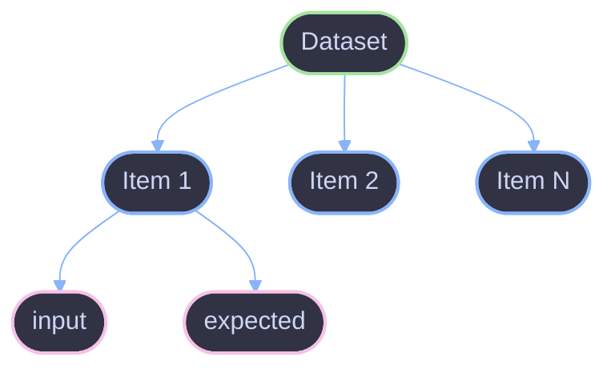

# Datasets

How to structure and use datasets in Viteval.

## Overview

A dataset is a collection of test cases for evaluation. Each item contains input data and optionally expected output for comparison.



## Dataset Structure

### Inline Data

Define data directly in evaluations:

```ts
evaluate('my-eval', {
  data: [
    { input: 'Hello', expected: 'Hi there!' },
    { input: 'Goodbye', expected: 'Farewell!' },
  ],
  task: myTask,
  scorers: [exactMatch],
});
```

### Defined Datasets

Create reusable datasets with `defineDataset`:

```ts
import { defineDataset } from 'viteval';

const greetings = defineDataset({
  name: 'greetings',
  items: [
    { input: 'Hello', expected: 'Hi there!' },
    { input: 'Good morning', expected: 'Good morning to you!' },
  ],
});
```

### From Files

Load datasets from JSON or CSV:

```ts
import { loadDataset } from 'viteval';

const dataset = await loadDataset('./data/test-cases.json');
```

## Data Item Schema

Each item can contain any properties. Common fields:

| Field      | Type  | Description                  |
| ---------- | ----- | ---------------------------- |
| `input`    | `any` | Input to pass to the task    |
| `expected` | `any` | Expected output for scoring  |
| `context`  | `any` | Additional context data      |
| `metadata` | `any` | Item metadata (tags, source) |

### Example with Context

```ts
const dataset = defineDataset({
  name: 'qa-pairs',
  items: [
    {
      input: 'What is the capital of France?',
      expected: 'Paris',
      context: {
        category: 'geography',
        difficulty: 'easy',
      },
    },
  ],
});
```

## Dataset Transformations

### Filtering

Filter items before evaluation:

```ts
const easyItems = dataset.filter((item) => item.context?.difficulty === 'easy');
```

### Sampling

Sample a subset for quick tests:

```ts
const sample = dataset.sample(10);
```

### Mapping

Transform items:

```ts
const transformed = dataset.map((item) => ({
  ...item,
  input: item.input.toLowerCase(),
}));
```

## File Formats

### JSON

```json
[
  { "input": "Hello", "expected": "Hi!" },
  { "input": "Bye", "expected": "Goodbye!" }
]
```

### CSV

```csv
input,expected
Hello,Hi!
Bye,Goodbye!
```

### JSONL

```jsonl
{"input": "Hello", "expected": "Hi!"}
{"input": "Bye", "expected": "Goodbye!"}
```

## Large Datasets

For large datasets, use streaming:

```ts
import { streamDataset } from 'viteval';

evaluate('large-eval', {
  data: streamDataset('./large-dataset.jsonl'),
  task: myTask,
  scorers: [myScorer],
});
```

## References

- [Evaluation](./evaluation.md) - Evaluation concepts
- [Scorers](./scorers.md) - How scorers work
- [Add Example](../guides/add-example.md) - Creating examples
