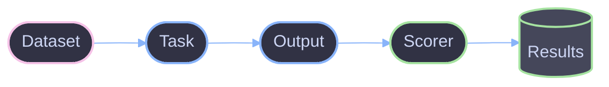

# Evaluation

Core concepts for running LLM evaluations with Viteval.

## Overview

An evaluation tests how well an LLM performs on a specific task. Viteval runs evaluations as Vitest test suites, giving you speed, parallelization, and familiar tooling.



## Components

| Component   | Description                                     |
| ----------- | ----------------------------------------------- |
| **Dataset** | Collection of test cases (input/expected pairs) |
| **Task**    | Function that calls your LLM                    |
| **Scorer**  | Function that evaluates task output             |
| **Results** | Aggregated scores and metrics                   |

## Basic Evaluation

```ts
import { evaluate } from 'viteval';

evaluate('my-eval', {
  data: [
    { input: 'Hello', expected: 'Hi there!' },
    { input: 'Goodbye', expected: 'See you later!' },
  ],
  task: async ({ input }) => {
    // Call your LLM here
    return llm.generate(input);
  },
  scorers: [exactMatch, semanticSimilarity],
});
```

## How It Works

1. **Load Data** - Dataset items are loaded
2. **Run Task** - Task function is called for each item
3. **Score Results** - Scorers evaluate each output
4. **Aggregate** - Results are combined into metrics
5. **Report** - Results displayed or saved

## Parallelization

Evaluations run in parallel by default. Control concurrency:

```ts
evaluate('my-eval', {
  data: myDataset,
  task: myTask,
  scorers: [myScorer],
  concurrency: 5, // Run 5 evaluations at once
});
```

## Configuration

Configure evaluations via `viteval.config.ts`:

```ts
import { defineConfig } from 'viteval';

export default defineConfig({
  timeout: 30000,
  reporters: ['default', 'json'],
});
```

## References

- [Scorers](./scorers.md) - How scorers work
- [Datasets](./datasets.md) - Dataset formats
- [Architecture](../architecture.md) - Package structure
