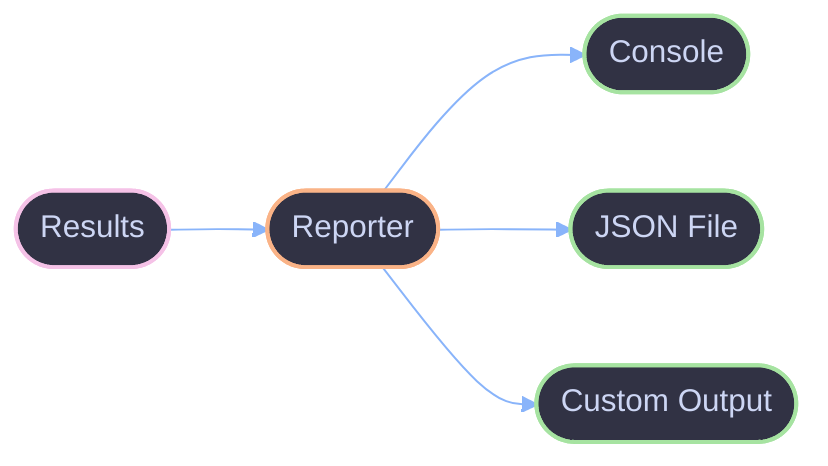

# Reporters

How reporters format and output evaluation results in Viteval.

## Overview

A reporter receives evaluation results and outputs them in a specific format. Reporters can write to the console, files, or external services.



## Built-in Reporters

Viteval includes several reporters:

| Reporter  | Description                         |
| --------- | ----------------------------------- |
| `default` | Human-readable console output       |
| `json`    | JSON file output                    |
| `verbose` | Detailed console output with scores |
| `summary` | Compact summary statistics          |

## Using Reporters

Configure reporters in `viteval.config.ts`:

```ts
import { defineConfig } from 'viteval';

export default defineConfig({
  reporters: ['default', 'json'],
});
```

Or specify per-evaluation:

```ts
evaluate('my-eval', {
  data: myDataset,
  task: myTask,
  scorers: [myScorer],
  reporters: ['verbose'],
});
```

## Reporter Output

### Default Reporter

```
✓ my-eval (100 items)
  Scorers:
    exact-match: 0.85 avg
    relevance: 0.92 avg
  Duration: 12.3s
```

### JSON Reporter

```json
{
  "name": "my-eval",
  "items": 100,
  "scores": {
    "exact-match": { "avg": 0.85, "min": 0.0, "max": 1.0 },
    "relevance": { "avg": 0.92, "min": 0.65, "max": 1.0 }
  },
  "duration": 12300
}
```

## Custom Reporters

Create custom reporters by implementing the reporter interface:

```ts
import { createReporter } from 'viteval';

const myReporter = createReporter({
  name: 'my-reporter',
  onStart: (evaluation) => {
    console.log(`Starting: ${evaluation.name}`);
  },
  onResult: (item, scores) => {
    // Called for each evaluated item
  },
  onEnd: (summary) => {
    console.log(`Completed: ${summary.total} items`);
  },
});
```

## Reporter Events

Reporters receive events during evaluation:

| Event      | Description             | Data               |
| ---------- | ----------------------- | ------------------ |
| `onStart`  | Evaluation begins       | Evaluation config  |
| `onResult` | Single item evaluated   | Item, scores       |
| `onError`  | Error during evaluation | Error, item        |
| `onEnd`    | Evaluation completes    | Summary statistics |

## Multiple Reporters

Use multiple reporters simultaneously:

```ts
export default defineConfig({
  reporters: [
    'default', // Console output
    'json', // JSON file
    myCustomReporter, // Custom reporter
  ],
});
```

## Reporter Options

Some reporters accept options:

```ts
export default defineConfig({
  reporters: [
    ['json', { outputPath: './results/eval.json' }],
    ['verbose', { showScores: true }],
  ],
});
```

## Troubleshooting

### Reporter not called

**Issue:** Custom reporter methods aren't being invoked.

**Fix:** Ensure the reporter is properly registered:

```ts
export default defineConfig({
  reporters: [myReporter], // Not 'myReporter' as string
});
```

### JSON file not created

**Issue:** JSON reporter doesn't create output file.

**Fix:** Check the output path is writable and exists:

```ts
['json', { outputPath: './results/eval.json' }];
```

## References

- [Evaluation](./evaluation.md) - How evaluations work
- [Configuration](./configuration.md) - Config options
- [Architecture](../architecture.md) - System overview
