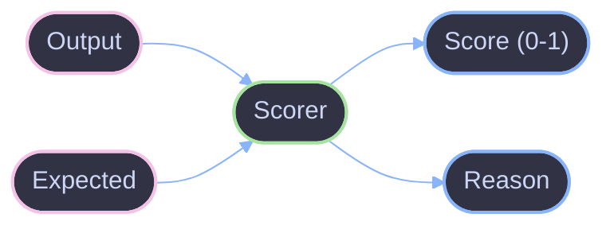

# Scorers

How scorers evaluate LLM outputs in Viteval.

## Overview

A scorer is a function that evaluates how well an LLM output matches expectations. Scorers return a score between 0 and 1, with optional metadata.



## Creating Scorers

Use `createScorer` to define custom scorers:

```ts
import { createScorer } from 'viteval';

const exactMatch = createScorer({
  name: 'exact-match',
  score: ({ output, expected }) => ({
    score: output === expected ? 1.0 : 0.0,
  }),
});
```

## Scorer Input

Scorers receive the full evaluation context:

| Property   | Type     | Description                |
| ---------- | -------- | -------------------------- |
| `input`    | `any`    | Original input to the task |
| `output`   | `any`    | Task output to evaluate    |
| `expected` | `any`    | Expected output (optional) |
| `context`  | `object` | Additional context data    |

## Scorer Output

Return a `ScorerResult` object:

```ts
interface ScorerResult {
  score: number; // 0-1 range
  reason?: string; // Explanation
  metadata?: object; // Additional data
}
```

### With Explanation

```ts
const scorer = createScorer({
  name: 'length-check',
  score: ({ output, expected }) => {
    const score = output.length >= expected.length ? 1.0 : 0.5;
    return {
      score,
      reason: `Output length: ${output.length}, expected: ${expected.length}`,
    };
  },
});
```

## LLM-Based Scorers

Use LLMs to evaluate outputs:

```ts
const relevanceScorer = createScorer({
  name: 'relevance',
  score: async ({ input, output }) => {
    const response = await llm.generate(`
      Rate the relevance of this response (0-1):
      Question: ${input}
      Answer: ${output}
    `);
    return { score: parseFloat(response) };
  },
});
```

## Built-in Scorers

Viteval includes common scorers:

| Scorer               | Description                |
| -------------------- | -------------------------- |
| `exactMatch`         | Exact string equality      |
| `contains`           | Output contains expected   |
| `jsonValidity`       | Output is valid JSON       |
| `semanticSimilarity` | Embedding-based similarity |

## Multiple Scorers

Use multiple scorers to evaluate different aspects:

```ts
evaluate('my-eval', {
  data: myDataset,
  task: myTask,
  scorers: [exactMatch, relevanceScorer, jsonValidity],
});
```

## References

- [Evaluation](./evaluation.md) - Evaluation concepts
- [Datasets](./datasets.md) - Dataset formats
- [Add a Test](../guides/add-test.md) - Writing tests
