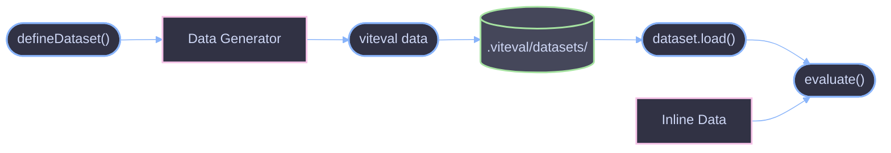

# Datasets API

Reference for defining, generating, and managing evaluation datasets.

## Overview

Datasets provide reusable test data for evaluations. Viteval supports inline data, generator functions, and persistent datasets stored as JSON files.

## Import

```ts
import { defineDataset } from 'viteval/dataset';
```

---

## defineDataset

Create a reusable, persistable dataset.

### Signature

```ts
function defineDataset<DATA_FUNC extends DataGenerator>(
  config: DatasetConfig<DATA_FUNC>
): Dataset<DATA_FUNC>;
```

### DatasetConfig

| Property      | Type                        | Default   | Description               |
| ------------- | --------------------------- | --------- | ------------------------- |
| `name`        | `string`                    | required  | Unique dataset identifier |
| `description` | `string`                    | -         | Optional description      |
| `storage`     | `'local' \| 'memory'`       | `'local'` | Storage type              |
| `data`        | `() => Promise<DataItem[]>` | required  | Data generator function   |

### Storage Types

| Type     | Description                                  |
| -------- | -------------------------------------------- |
| `local`  | Persisted to `.viteval/datasets/<name>.json` |
| `memory` | Generated fresh each run, not persisted      |

### Basic Dataset

```ts
// questions.dataset.ts
import { defineDataset } from 'viteval/dataset';

export default defineDataset({
  name: 'questions',
  data: async () => [
    { input: 'What is 2+2?', expected: '4' },
    { input: 'What is 3+3?', expected: '6' },
  ],
});
```

### Generated Dataset

```ts
// generated.dataset.ts
import { defineDataset } from 'viteval/dataset';

export default defineDataset({
  name: 'generated-questions',
  description: 'Dynamically generated math questions',
  data: async () => {
    const questions = [];
    for (let i = 0; i < 100; i++) {
      const a = Math.floor(Math.random() * 10);
      const b = Math.floor(Math.random() * 10);
      questions.push({
        input: `What is ${a}+${b}?`,
        expected: String(a + b),
      });
    }
    return questions;
  },
});
```

### LLM-Generated Dataset

```ts
// llm-generated.dataset.ts
import { defineDataset } from 'viteval/dataset';
import { generateObject } from 'ai';
import { openai } from '@ai-sdk/openai';
import { z } from 'zod';

export default defineDataset({
  name: 'qa-pairs',
  data: async () => {
    const results = [];

    for (let i = 0; i < 50; i++) {
      const { object } = await generateObject({
        model: openai('gpt-4o'),
        prompt: 'Create a trivia question and answer',
        schema: z.object({
          question: z.string(),
          answer: z.string(),
        }),
      });

      results.push({
        input: object.question,
        expected: object.answer,
      });
    }

    return results;
  },
});
```

### Memory-Only Dataset

```ts
// volatile.dataset.ts
import { defineDataset } from 'viteval/dataset';

export default defineDataset({
  name: 'volatile-data',
  storage: 'memory', // Not persisted
  data: async () => {
    // Fresh data every run
    const timestamp = Date.now();
    return [{ input: `Test at ${timestamp}`, expected: 'response' }];
  },
});
```

### With Extra Properties

```ts
// context.dataset.ts
import { defineDataset } from 'viteval/dataset';

interface QAItem {
  input: string;
  expected: string;
  context: string;
  difficulty: 'easy' | 'medium' | 'hard';
}

export default defineDataset({
  name: 'contextual-qa',
  data: async (): Promise<QAItem[]> => [
    {
      input: 'What is the capital?',
      expected: 'Paris',
      context: 'We are discussing France.',
      difficulty: 'easy',
    },
    {
      input: 'What is the GDP?',
      expected: '2.9 trillion USD',
      context: 'We are discussing France economics.',
      difficulty: 'hard',
    },
  ],
});
```

---

## Dataset Object

The returned dataset object has methods for managing data.

### Methods

| Method     | Signature                                   | Description                        |
| ---------- | ------------------------------------------- | ---------------------------------- |
| `exists()` | `() => Promise<boolean>`                    | Check if dataset exists in storage |
| `load()`   | `(options?) => Promise<DataItem[] \| null>` | Load dataset from storage          |
| `save()`   | `(options?) => Promise<void>`               | Save dataset to storage            |

### Load Options

| Option   | Type      | Default | Description             |
| -------- | --------- | ------- | ----------------------- |
| `create` | `boolean` | `false` | Create if doesn't exist |

### Save Options

| Option      | Type      | Default | Description                |
| ----------- | --------- | ------- | -------------------------- |
| `overwrite` | `boolean` | `false` | Overwrite existing dataset |

### Manual Dataset Operations

```ts
import myDataset from './my.dataset';

// Check existence
const exists = await myDataset.exists();

// Load (returns null if not exists)
const data = await myDataset.load();

// Load with auto-create
const dataOrCreate = await myDataset.load({ create: true });

// Save (skip if exists)
await myDataset.save();

// Save with overwrite
await myDataset.save({ overwrite: true });
```

---

## Using Datasets in Evaluations

### Direct Reference

```ts
import { evaluate, scorers } from 'viteval';
import questionsDataset from './questions.dataset';

evaluate('QA Evaluation', {
  task: async ({ input }) => await llm.generate(input),
  scorers: [scorers.exactMatch],
  data: questionsDataset, // Dataset auto-loads
});
```

### Multiple Datasets

```ts
import { evaluate, scorers } from 'viteval';
import easyQuestions from './easy.dataset';
import hardQuestions from './hard.dataset';

evaluate('Easy Questions', {
  task: async ({ input }) => await llm.generate(input),
  scorers: [scorers.exactMatch],
  data: easyQuestions,
  threshold: 0.9,
});

evaluate('Hard Questions', {
  task: async ({ input }) => await llm.generate(input),
  scorers: [scorers.factual],
  data: hardQuestions,
  threshold: 0.7,
});
```

---

## CLI Dataset Generation

Use `viteval data` to generate datasets before running evaluations.

```bash
# Generate all datasets
viteval data

# Generate specific pattern
viteval data "src/**/*.dataset.ts"

# Overwrite existing
viteval data --overwrite

# Verbose errors
viteval data --verbose
```

### Dataset File Convention

| Pattern         | Description             |
| --------------- | ----------------------- |
| `*.dataset.ts`  | TypeScript dataset file |
| `*.dataset.js`  | JavaScript dataset file |
| `*.dataset.mts` | TypeScript ESM dataset  |
| `*.dataset.mjs` | JavaScript ESM dataset  |

---

## Storage Format

Datasets are stored as JSON in `.viteval/datasets/`.

### File Location

```
.viteval/
└── datasets/
    ├── questions.json
    ├── qa-pairs.json
    └── contextual-qa.json
```

### File Structure

```json
{
  "timestamp": "2024-01-15T10:30:00.000Z",
  "data": [
    {
      "input": "What is 2+2?",
      "expected": "4"
    },
    {
      "input": "What is 3+3?",
      "expected": "6"
    }
  ]
}
```

---

## Types

### DataItem

```ts
interface DataItem<INPUT = unknown, OUTPUT = unknown, EXTRA = {}> {
  name?: string; // Optional test name
  input: INPUT; // Input to task
  expected: OUTPUT; // Expected output
  [key: string]: any; // Extra properties
}
```

### DataGenerator

```ts
type DataGenerator<DATA_ITEM extends DataItem = DataItem> = () => Promise<
  DATA_ITEM[]
>;
```

### Data

Data can be provided in three forms:

```ts
type Data<DATA_ITEM extends DataItem = DataItem> =
  | DATA_ITEM[] // Inline array
  | DataGenerator<DATA_ITEM> // Generator function
  | Dataset<DataGenerator<DATA_ITEM>>; // Dataset object
```

### DatasetStorage

```ts
type DatasetStorage = 'local' | 'memory';
```

---

## Dataset Flow



---

## Best Practices

### 1. Use Descriptive Names

```ts
// Good
defineDataset({ name: 'math-word-problems', ... });

// Avoid
defineDataset({ name: 'data1', ... });
```

### 2. Add Descriptions

```ts
defineDataset({
  name: 'customer-support',
  description: 'Real customer inquiries from Q4 2023',
  data: async () => [...],
});
```

### 3. Type Your Data

```ts
interface SupportTicket {
  input: string;
  expected: string;
  category: 'billing' | 'technical' | 'general';
  priority: number;
}

defineDataset({
  name: 'support-tickets',
  data: async (): Promise<SupportTicket[]> => [...],
});
```

### 4. Use Memory for Volatile Data

```ts
defineDataset({
  name: 'timestamp-tests',
  storage: 'memory',  // Fresh data each run
  data: async () => [...],
});
```

---

## References

- [Core API](./core.md) - Using datasets with `evaluate`
- [CLI Commands](../cli/commands.md) - `viteval data` command
- [Scorers API](./scorers.md) - Scoring evaluation results
