# API Overview

Core API for defining and running LLM evaluations with Viteval.

## Overview

Viteval provides a TypeScript-first API for evaluating LLM outputs. The API is built on Vitest and extends it with evaluation-specific primitives: tasks, scorers, datasets, and reporters.

## Core Exports

```ts
// Main package exports
import { evaluate, scorers, createScorer } from 'viteval';

// Configuration
import { defineConfig } from 'viteval/config';

// Datasets
import { defineDataset } from 'viteval/dataset';
```

## API Components

| Component                                   | Description                        |
| ------------------------------------------- | ---------------------------------- |
| [`evaluate`](./core.md#evaluate)            | Define and run an evaluation suite |
| [`defineConfig`](./core.md#defineconfig)    | Configure Viteval behavior         |
| [`createScorer`](./scorers.md#createscorer) | Create custom scoring functions    |
| [`scorers`](./scorers.md#built-in-scorers)  | Pre-built scoring functions        |
| [`defineDataset`](./datasets.md)            | Define reusable test datasets      |
| [`JsonReporter`](./reporters.md)            | JSON output reporter               |

## Basic Example

```ts
import { evaluate, scorers } from 'viteval';

// Define an evaluation
evaluate('Math Questions', {
  // Task function to evaluate
  task: async ({ input }) => {
    const response = await llm.generate(input);
    return response.text;
  },

  // Scorers to measure quality
  scorers: [scorers.exactMatch],

  // Test data
  data: [
    { input: 'What is 2+2?', expected: '4' },
    { input: 'What is 10/2?', expected: '5' },
  ],

  // Pass threshold (0-1)
  threshold: 0.8,
});
```

## Evaluation Flow

```mermaid
%%{init: {
  'theme': 'base',
  'themeVariables': {
    'primaryColor': '#313244',
    'primaryTextColor': '#cdd6f4',
    'primaryBorderColor': '#6c7086',
    'lineColor': '#89b4fa',
    'secondaryColor': '#45475a',
    'tertiaryColor': '#1e1e2e',
    'background': '#1e1e2e',
    'mainBkg': '#313244',
    'clusterBkg': '#1e1e2e',
    'clusterBorder': '#45475a'
  },
  'flowchart': { 'curve': 'basis', 'padding': 15 }
}}%%
flowchart LR
    subgraph input [" Input "]
        data(["Data"])
        task(["Task"])
    end

    subgraph eval [" Evaluation "]
        run(["evaluate()"])
        score(["Scorers"])
    end

    subgraph output [" Output "]
        results[("Results")]
        reporter(["Reporter"])
    end

    data --> run
    task --> run
    run --> score
    score --> results
    results --> reporter

    style input fill:none,stroke:#f5c2e7,stroke-width:2px,stroke-dasharray:5 5
    style eval fill:#181825,stroke:#89b4fa,stroke-width:2px
    style output fill:none,stroke:#fab387,stroke-width:2px,stroke-dasharray:5 5

    classDef external fill:#313244,stroke:#f5c2e7,stroke-width:2px,color:#cdd6f4
    classDef core fill:#313244,stroke:#89b4fa,stroke-width:2px,color:#cdd6f4
    classDef scorer fill:#313244,stroke:#a6e3a1,stroke-width:2px,color:#cdd6f4
    classDef storage fill:#45475a,stroke:#a6e3a1,stroke-width:2px,color:#cdd6f4
    classDef middleware fill:#313244,stroke:#fab387,stroke-width:2px,color:#cdd6f4

    class data,task external
    class run core
    class score scorer
    class results storage
    class reporter middleware
```



## Type Safety

Viteval infers types from your data to provide full type safety for tasks and scorers.

```ts
// Data type is inferred
const data = [{ input: 'Hello', expected: 'Hello', context: 'greeting' }];

evaluate('Typed Eval', {
  // input, expected, and context are typed
  task: async ({ input, context }) => {
    return `${context}: ${input}`;
  },
  scorers: [scorers.exactMatch],
  data,
});
```

## Configuration Example

```ts
// viteval.config.ts
import { defineConfig } from 'viteval/config';

export default defineConfig({
  reporters: ['default', 'file'],
  eval: {
    include: ['src/**/*.eval.ts'],
    setupFiles: ['./viteval.setup.ts'],
    timeout: 30000,
  },
  provider: {
    openai: {
      apiKey: process.env.OPENAI_API_KEY,
    },
  },
});
```

## Package Exports

| Import Path       | Exports                                      |
| ----------------- | -------------------------------------------- |
| `viteval`         | `evaluate`, `scorers`, `createScorer`, types |
| `viteval/config`  | `defineConfig`                               |
| `viteval/dataset` | `defineDataset`                              |

## References

- [Core API](./core.md) - `evaluate` and `defineConfig`
- [Scorers API](./scorers.md) - Scoring functions
- [Datasets API](./datasets.md) - Dataset definition
- [Reporters API](./reporters.md) - Output reporters
- [Vitest Documentation](https://vitest.dev) - Underlying test framework
