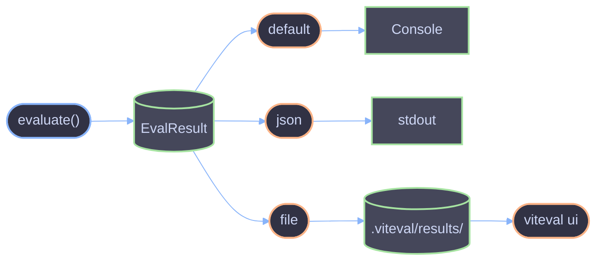

# Reporters API

Reference for output reporters and result formatting.

## Overview

Reporters format and output evaluation results. Viteval provides built-in reporters for console output, JSON, and file-based persistence. The reporting system is built on Vitest's reporter infrastructure.

## Available Reporters

| Reporter  | Description                                        |
| --------- | -------------------------------------------------- |
| `default` | Console output with pass/fail summary (Vitest)     |
| `json`    | JSON output to stdout                              |
| `file`    | JSON output to `.viteval/results/<timestamp>.json` |

## Configuration

### Via CLI

```bash
# Single reporter
viteval run -r json

# Multiple reporters
viteval run -r default -r file

# With UI (auto-adds file reporter)
viteval run --ui
```

### Via Config

```ts
// viteval.config.ts
import { defineConfig } from 'viteval/config';

export default defineConfig({
  reporters: ['default', 'file'],
  eval: {
    include: ['**/*.eval.ts'],
  },
});
```

---

## JsonReporter

Outputs comprehensive JSON format for analysis and UI consumption.

### Import

```ts
import { JsonReporter } from '@viteval/core/reporters';
```

### Constructor

```ts
new JsonReporter(options?: JsonReporterOptions)
```

### Options

| Option       | Type     | Default | Description             |
| ------------ | -------- | ------- | ----------------------- |
| `outputFile` | `string` | `null`  | Path to write JSON file |

### Programmatic Usage

```ts
// viteval.config.ts
import { defineConfig } from 'viteval/config';
import { JsonReporter } from '@viteval/core/reporters';

export default defineConfig({
  // Using string shorthand
  reporters: ['default', 'json'],

  eval: {
    include: ['**/*.eval.ts'],
  },
});
```

### Direct Reporter Instance

```ts
import { JsonReporter } from '@viteval/core/reporters';
import { createVitest } from 'vitest/node';

const vitest = await createVitest('test', {
  reporters: ['default', new JsonReporter({ outputFile: 'results.json' })],
});
```

---

## JSON Output Format

### JsonEvalResults

Root output structure.

| Property              | Type                      | Description                    |
| --------------------- | ------------------------- | ------------------------------ |
| `status`              | `'running' \| 'finished'` | Current status                 |
| `success`             | `boolean`                 | All evaluations passed         |
| `numTotalEvalSuites`  | `number`                  | Total evaluation suites        |
| `numPassedEvalSuites` | `number`                  | Passed evaluation suites       |
| `numFailedEvalSuites` | `number`                  | Failed evaluation suites       |
| `numTotalEvals`       | `number`                  | Total individual evaluations   |
| `numPassedEvals`      | `number`                  | Passed individual evaluations  |
| `numFailedEvals`      | `number`                  | Failed individual evaluations  |
| `startTime`           | `number`                  | Start timestamp (epoch ms)     |
| `endTime`             | `number`                  | End timestamp (epoch ms)       |
| `duration`            | `number`                  | Total duration in milliseconds |
| `evalResults`         | `JsonEvalSuite[]`         | Suite-level results            |

### JsonEvalSuite

Per-suite results.

| Property      | Type                   | Description                   |
| ------------- | ---------------------- | ----------------------------- |
| `name`        | `string`               | Suite name                    |
| `filepath`    | `string`               | Relative file path            |
| `status`      | `'passed' \| 'failed'` | Suite status                  |
| `startTime`   | `number`               | Start timestamp               |
| `endTime`     | `number`               | End timestamp                 |
| `duration`    | `number`               | Duration in milliseconds      |
| `evalResults` | `EvalResult[]`         | Individual evaluation results |
| `message`     | `string`               | Error message (if failed)     |
| `summary`     | `SuiteSummary`         | Aggregated metrics            |

### SuiteSummary

| Property      | Type     | Description                  |
| ------------- | -------- | ---------------------------- |
| `meanScore`   | `number` | Average score across evals   |
| `medianScore` | `number` | Median score across evals    |
| `sumScore`    | `number` | Total score sum              |
| `passedCount` | `number` | Number of passed evaluations |
| `totalCount`  | `number` | Total number of evaluations  |

### EvalResult

Individual evaluation result.

| Property      | Type                      | Description               |
| ------------- | ------------------------- | ------------------------- |
| `name`        | `string`                  | Evaluation name           |
| `sum`         | `number`                  | Sum of scores             |
| `mean`        | `number`                  | Mean of scores            |
| `median`      | `number`                  | Median of scores          |
| `threshold`   | `number`                  | Pass threshold            |
| `aggregation` | `string`                  | Aggregation method used   |
| `scores`      | `Score[]`                 | Individual scorer results |
| `input`       | `unknown`                 | Task input                |
| `expected`    | `unknown`                 | Expected output           |
| `output`      | `unknown`                 | Actual output             |
| `metadata`    | `Record<string, unknown>` | Extra metadata            |

---

## Example Output

### JSON Format

```json
{
  "status": "finished",
  "success": true,
  "numTotalEvalSuites": 1,
  "numPassedEvalSuites": 1,
  "numFailedEvalSuites": 0,
  "numTotalEvals": 3,
  "numPassedEvals": 3,
  "numFailedEvals": 0,
  "startTime": 1705312200000,
  "endTime": 1705312205000,
  "duration": 5000,
  "evalResults": [
    {
      "name": "Math Questions",
      "filepath": "src/math.eval.ts",
      "status": "passed",
      "startTime": 1705312200000,
      "endTime": 1705312205000,
      "duration": 5000,
      "evalResults": [
        {
          "name": "What is 2+2?",
          "sum": 2,
          "mean": 1,
          "median": 1,
          "threshold": 0.8,
          "aggregation": "mean",
          "scores": [
            { "name": "exactMatch", "score": 1 },
            { "name": "levenshtein", "score": 1 }
          ],
          "input": "What is 2+2?",
          "expected": "4",
          "output": "4"
        }
      ],
      "summary": {
        "meanScore": 1,
        "medianScore": 1,
        "sumScore": 2,
        "passedCount": 3,
        "totalCount": 3
      }
    }
  ]
}
```

---

## File Reporter

The `file` reporter writes JSON to `.viteval/results/` with timestamps.

### Output Location

```
.viteval/
└── results/
    ├── 1705312200000.json
    ├── 1705312300000.json
    └── 1705312400000.json
```

### Usage

```bash
# CLI
viteval run -r file

# Or with UI (auto-includes file reporter)
viteval run --ui
```

```ts
// Config
export default defineConfig({
  reporters: ['default', 'file'],
});
```

---

## Viewing Results

### Via UI

```bash
# Run with file reporter
viteval run -r file

# View in browser
viteval ui --open
```

### Via JSON

```bash
# Output to stdout
viteval run -r json

# Pipe to jq
viteval run -r json | jq '.evalResults[0].summary'
```

---

## Reporter Flow



---

## Types

### VitevalReporter

```ts
type VitevalReporter = 'default' | 'json' | 'file';
```

### JsonEvalResults

```ts
interface JsonEvalResults {
  status: 'running' | 'finished';
  success: boolean;
  numTotalEvalSuites: number;
  numPassedEvalSuites: number;
  numFailedEvalSuites: number;
  numTotalEvals: number;
  numPassedEvals: number;
  numFailedEvals: number;
  startTime: number;
  endTime?: number;
  duration?: number;
  evalResults: JsonEvalSuite[];
}
```

### JsonEvalSuite

```ts
interface JsonEvalSuite {
  name: string;
  filepath: string;
  status: 'passed' | 'failed';
  startTime: number;
  endTime: number;
  duration: number;
  evalResults: EvalResult[];
  message?: string;
  summary: {
    meanScore: number;
    medianScore: number;
    sumScore: number;
    passedCount: number;
    totalCount: number;
  };
}
```

---

## Custom Reporters

Create custom reporters by implementing Vitest's Reporter interface.

```ts
import type { Reporter } from 'vitest/reporters';

class CustomReporter implements Reporter {
  onInit() {
    console.log('Starting evaluations...');
  }

  onFinished(files) {
    for (const file of files) {
      // Process results
      const results = file.meta?.results || [];
      console.log(`Completed: ${file.filepath}`);
    }
  }
}

// Use in config
export default defineConfig({
  reporters: ['default', new CustomReporter()],
});
```

---

## References

- [Core API](./core.md) - Evaluation configuration
- [CLI Commands](../cli/commands.md) - Reporter CLI options
- [Vitest Reporters](https://vitest.dev/guide/reporters.html) - Underlying reporter system
