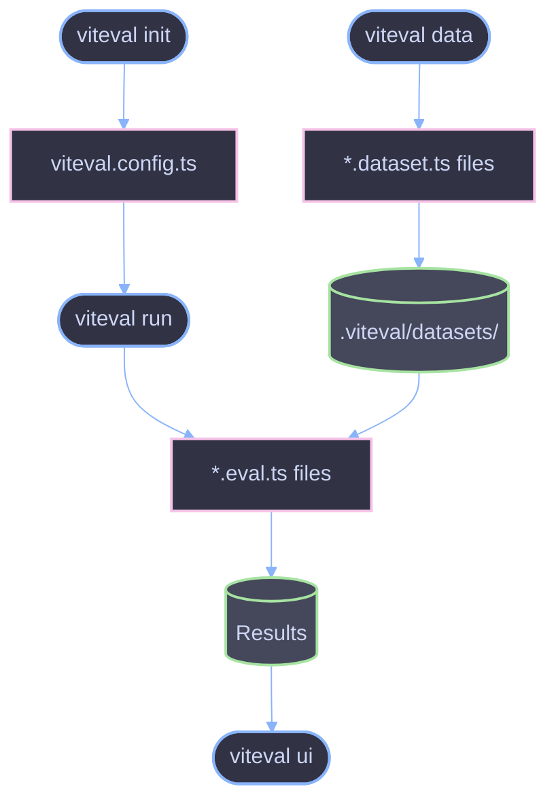

# CLI Overview

Command-line interface for running LLM evaluations with Viteval.

## Overview

The Viteval CLI provides commands to initialize projects, run evaluations, generate datasets, and view results. It wraps Vitest's test runner with LLM evaluation-specific functionality.

## Installation

```bash
# Install with npm
npm install viteval

# Install with pnpm
pnpm add viteval

# Install with yarn
yarn add viteval
```

The `viteval` command is available after installation via `npx viteval` or through package.json scripts.

## Available Commands

| Command | Description                             | Alias |
| ------- | --------------------------------------- | ----- |
| `run`   | Run evaluations                         | `*`   |
| `init`  | Initialize a new Viteval project        | -     |
| `data`  | Generate datasets from dataset files    | -     |
| `ui`    | Start the UI server for viewing results | -     |

## Basic Usage

```bash
# Run all evaluations
viteval run

# Run with a pattern
viteval run "src/**/*.eval.ts"

# Initialize a new project
viteval init

# Generate datasets
viteval data

# View results in UI
viteval ui
```

## Command Flow



## Global Options

| Option      | Alias | Description         |
| ----------- | ----- | ------------------- |
| `--help`    | `-h`  | Show help message   |
| `--version` | `-v`  | Show version number |

## Configuration

The CLI reads configuration from `viteval.config.ts` (or `.js`, `.mts`, `.mjs`) in the project root.

```ts
// viteval.config.ts
import { defineConfig } from 'viteval/config';

export default defineConfig({
  reporters: ['default', 'file'],
  eval: {
    include: ['src/**/*.eval.ts'],
    setupFiles: ['./viteval.setup.ts'],
    timeout: 30000,
  },
});
```

## Project Structure

After running `viteval init`, your project will have:

```
project/
├── viteval.config.ts    # Configuration file
├── viteval.setup.ts     # Setup file (loads env vars)
├── .env                 # Environment variables
├── .viteval/            # Generated data directory
│   ├── datasets/        # Stored datasets
│   └── results/         # Evaluation results
└── src/
    ├── *.eval.ts        # Evaluation files
    └── *.dataset.ts     # Dataset definitions
```

## References

- [CLI Commands](./commands.md) - Complete command reference
- [Core API](../api/core.md) - `defineConfig` options
- [Vitest CLI](https://vitest.dev/guide/cli.html) - Underlying CLI documentation
