# Reference Documentation

Technical reference for the Viteval API and CLI.

## Overview

This section provides detailed technical documentation for developers using Viteval. Reference docs are organized by interface type and cover all available functions, options, and configuration.

## Documentation Structure

| Section                             | Description                             |
| ----------------------------------- | --------------------------------------- |
| [CLI Overview](./cli/overview.md)   | Command-line interface introduction     |
| [CLI Commands](./cli/commands.md)   | Complete command reference with flags   |
| [API Overview](./api/overview.md)   | Core API introduction                   |
| [Core API](./api/core.md)           | `evaluate` and `defineConfig` functions |
| [Scorers API](./api/scorers.md)     | Built-in and custom scorer creation     |
| [Datasets API](./api/datasets.md)   | Dataset definition and management       |
| [Reporters API](./api/reporters.md) | Output formatting and reporting         |

## Quick Start

### CLI Usage

```bash
# Initialize a new project
viteval init

# Run evaluations
viteval run

# Generate datasets
viteval data
```

### API Usage

```ts
import { evaluate, scorers, defineDataset } from 'viteval';
import { defineConfig } from 'viteval/config';

// Define an evaluation
evaluate('My Eval', {
  task: async ({ input }) => callLLM(input),
  scorers: [scorers.exactMatch],
  data: [{ input: 'Hello', expected: 'Hello' }],
});
```

## Architecture Diagram

```mermaid
%%{init: {
  'theme': 'base',
  'themeVariables': {
    'primaryColor': '#313244',
    'primaryTextColor': '#cdd6f4',
    'primaryBorderColor': '#6c7086',
    'lineColor': '#89b4fa',
    'secondaryColor': '#45475a',
    'tertiaryColor': '#1e1e2e',
    'background': '#1e1e2e',
    'mainBkg': '#313244',
    'clusterBkg': '#1e1e2e',
    'clusterBorder': '#45475a'
  },
  'flowchart': { 'curve': 'basis', 'padding': 15 }
}}%%
flowchart LR
    subgraph cli [" CLI "]
        run(["viteval run"])
        init(["viteval init"])
        data(["viteval data"])
        ui(["viteval ui"])
    end

    subgraph core [" Core API "]
        evaluate(["evaluate()"])
        config(["defineConfig()"])
    end

    subgraph components [" Components "]
        scorer(["Scorers"])
        dataset(["Datasets"])
        reporter(["Reporters"])
    end

    run --> evaluate
    run --> config
    data --> dataset
    evaluate --> scorer
    evaluate --> dataset
    evaluate --> reporter

    style cli fill:none,stroke:#89b4fa,stroke-width:2px,stroke-dasharray:5 5
    style core fill:#181825,stroke:#89b4fa,stroke-width:2px
    style components fill:none,stroke:#a6e3a1,stroke-width:2px,stroke-dasharray:5 5

    classDef core fill:#313244,stroke:#89b4fa,stroke-width:2px,color:#cdd6f4
    classDef scorer fill:#313244,stroke:#a6e3a1,stroke-width:2px,color:#cdd6f4
    classDef external fill:#313244,stroke:#f5c2e7,stroke-width:2px,color:#cdd6f4

    class run,init,data,ui,evaluate,config core
    class scorer,dataset,reporter scorer
```



## References

- [Architecture](../architecture.md) - System architecture overview
- [Getting Started](../guides/setup-local-env.md) - Local development setup
- [Vitest Documentation](https://vitest.dev) - Underlying test framework
