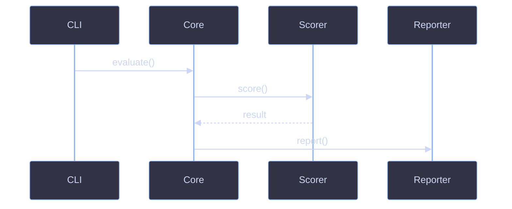
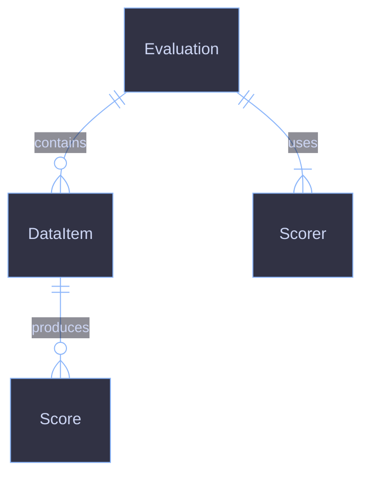

# Diagram Standards

Standards for creating beautiful, consistent Mermaid diagrams.

## Overview

All diagrams use **Mermaid** with the **Catppuccin Mocha** color theme. This creates a cohesive dark-mode aesthetic that renders well on GitHub and in documentation.

**Exception:** File tree structures may use ASCII art (see [File Tree Structures](#file-tree-structures)).

## Color Palette

Based on [Catppuccin Mocha](https://catppuccin.com/palette).

### Base Colors

| Name     | Hex       | Usage                                  |
| -------- | --------- | -------------------------------------- |
| Base     | `#1e1e2e` | Background, cluster backgrounds        |
| Surface0 | `#313244` | Node fill (primary)                    |
| Surface1 | `#45475a` | Node fill (secondary), cluster borders |
| Overlay0 | `#6c7086` | Disabled/future elements               |
| Text     | `#cdd6f4` | All text labels                        |

### Accent Colors

Use these for node borders and subgraph strokes to indicate purpose:

| Color | Hex       | Usage                              |
| ----- | --------- | ---------------------------------- |
| Pink  | `#f5c2e7` | External systems, inputs, triggers |
| Blue  | `#89b4fa` | Core app components, processing    |
| Green | `#a6e3a1` | Agents, storage, outputs, success  |
| Peach | `#fab387` | Gateways, middleware               |
| Gray  | `#6c7086` | Future/planned, disabled           |

### When to Use Each Color

```
Pink (#f5c2e7)   → External: LLM providers, user input, webhooks
Blue (#89b4fa)   → Internal: Core, CLI, UI, services
Green (#a6e3a1)  → AI/Data: Scorers, datasets, results
Peach (#fab387)  → Middleware: Reporters, transformers
Gray (#6c7086)   → Future: Planned features, disabled paths
```

---

## Flowchart Template

Copy this template for all flowcharts.

### Standard Flowchart


---

## Class Definitions

### Standard Classes

Add these class definitions to your diagrams and apply with `class` directive:

```
classDef external fill:#313244,stroke:#f5c2e7,stroke-width:2px,color:#cdd6f4
classDef core fill:#313244,stroke:#89b4fa,stroke-width:2px,color:#cdd6f4
classDef scorer fill:#313244,stroke:#a6e3a1,stroke-width:2px,color:#cdd6f4
classDef storage fill:#45475a,stroke:#a6e3a1,stroke-width:2px,color:#cdd6f4
classDef middleware fill:#313244,stroke:#fab387,stroke-width:2px,color:#cdd6f4
classDef future fill:#313244,stroke:#6c7086,stroke-width:2px,stroke-dasharray:3 3,color:#6c7086
```

### Applying Classes

```mermaid
class llm,user external
class core,cli,ui core
class exactMatch,semantic scorer
class dataset,results storage
class reporter middleware
class planned future
```

---

## Subgraph Styling

### Dashed Border (Groups of External/Conceptual Items)

```
style groupName fill:none,stroke:#f5c2e7,stroke-width:2px,stroke-dasharray:5 5
```

### Solid Border (Main Application Boundary)

```
style groupName fill:#181825,stroke:#89b4fa,stroke-width:2px
```

### Color by Purpose

| Purpose           | Style                                                            |
| ----------------- | ---------------------------------------------------------------- |
| External systems  | `fill:none,stroke:#f5c2e7,stroke-width:2px,stroke-dasharray:5 5` |
| Core processing   | `fill:none,stroke:#89b4fa,stroke-width:2px,stroke-dasharray:5 5` |
| Main app boundary | `fill:#181825,stroke:#89b4fa,stroke-width:2px`                   |
| Scorer group      | `fill:#181825,stroke:#a6e3a1,stroke-width:2px`                   |
| Storage layer     | `fill:none,stroke:#a6e3a1,stroke-width:2px,stroke-dasharray:5 5` |
| Middleware        | `fill:none,stroke:#fab387,stroke-width:2px,stroke-dasharray:5 5` |

---

## Complete Example

Architecture diagram with all patterns applied:

````markdown

```mermaid
%%{init: {
  'theme': 'base',
  'themeVariables': {
    'primaryColor': '#313244',
    'primaryTextColor': '#cdd6f4',
    'primaryBorderColor': '#6c7086',
    'lineColor': '#89b4fa',
    'secondaryColor': '#45475a',
    'tertiaryColor': '#1e1e2e',
    'background': '#1e1e2e',
    'mainBkg': '#313244',
    'clusterBkg': '#1e1e2e',
    'clusterBorder': '#45475a'
  },
  'flowchart': { 'curve': 'basis', 'padding': 15 }
}}%%
flowchart LR
    subgraph input [" "]
        dataset(["Dataset"])
        task(["Task"])
    end

    subgraph viteval ["Viteval"]
        core(["Core"])
        scorer(["Scorers"])
        results[("Results")]
    end

    subgraph output [" "]
        reporter(["Reporter"])
    end

    dataset --> core
    task --> core
    core --> scorer
    scorer --> results
    results --> reporter

    style input fill:none,stroke:#f5c2e7,stroke-width:2px,stroke-dasharray:5 5
    style viteval fill:#181825,stroke:#89b4fa,stroke-width:2px
    style output fill:none,stroke:#fab387,stroke-width:2px,stroke-dasharray:5 5

    classDef external fill:#313244,stroke:#f5c2e7,stroke-width:2px,color:#cdd6f4
    classDef core fill:#313244,stroke:#89b4fa,stroke-width:2px,color:#cdd6f4
    classDef scorer fill:#313244,stroke:#a6e3a1,stroke-width:2px,color:#cdd6f4
    classDef storage fill:#45475a,stroke:#a6e3a1,stroke-width:2px,color:#cdd6f4
    classDef middleware fill:#313244,stroke:#fab387,stroke-width:2px,color:#cdd6f4

    class dataset,task external
    class core core
    class scorer scorer
    class results storage
    class reporter middleware
```

````

---

## Copy-Paste Snippets

### Theme Init Block

```
%%{init: {
  'theme': 'base',
  'themeVariables': {
    'primaryColor': '#313244',
    'primaryTextColor': '#cdd6f4',
    'primaryBorderColor': '#6c7086',
    'lineColor': '#89b4fa',
    'secondaryColor': '#45475a',
    'tertiaryColor': '#1e1e2e',
    'background': '#1e1e2e',
    'mainBkg': '#313244',
    'clusterBkg': '#1e1e2e',
    'clusterBorder': '#45475a'
  },
  'flowchart': { 'curve': 'basis', 'padding': 15 }
}}%%
```

### All Class Definitions

```
classDef external fill:#313244,stroke:#f5c2e7,stroke-width:2px,color:#cdd6f4
classDef core fill:#313244,stroke:#89b4fa,stroke-width:2px,color:#cdd6f4
classDef scorer fill:#313244,stroke:#a6e3a1,stroke-width:2px,color:#cdd6f4
classDef storage fill:#45475a,stroke:#a6e3a1,stroke-width:2px,color:#cdd6f4
classDef middleware fill:#313244,stroke:#fab387,stroke-width:2px,color:#cdd6f4
classDef future fill:#313244,stroke:#6c7086,stroke-width:2px,stroke-dasharray:3 3,color:#6c7086
```

### All Subgraph Styles

```
style external fill:none,stroke:#f5c2e7,stroke-width:2px,stroke-dasharray:5 5
style processing fill:none,stroke:#89b4fa,stroke-width:2px,stroke-dasharray:5 5
style app fill:#181825,stroke:#89b4fa,stroke-width:2px
style scorers fill:#181825,stroke:#a6e3a1,stroke-width:2px
style storage fill:none,stroke:#a6e3a1,stroke-width:2px,stroke-dasharray:5 5
style middleware fill:none,stroke:#fab387,stroke-width:2px,stroke-dasharray:5 5
```

---

## Node Shapes

| Shape     | Syntax        | Usage                      |
| --------- | ------------- | -------------------------- |
| Rounded   | `(["Label"])` | Services, apps, components |
| Database  | `[("Label")]` | Databases, storage         |
| Rectangle | `["Label"]`   | Events, data, generic      |
| Diamond   | `{"Label"}`   | Decisions                  |
| Circle    | `(("Label"))` | Start/end points           |

---

## Line Styles

| Style        | Syntax           | Usage                    |
| ------------ | ---------------- | ------------------------ |
| Solid arrow  | `-->`            | Synchronous, direct flow |
| Dashed arrow | `-.->`           | Async, on-demand, future |
| Labeled      | `-- "label" -->` | Describe the connection  |
| Thick        | `==>`            | Primary/important flow   |

---

## Sequence Diagram Template



---

## ER Diagram Template



---

## File Tree Structures

File tree structures are the **only exception** to the Mermaid-only rule. ASCII art renders more clearly for directory hierarchies.

### Format

Use box-drawing characters for tree branches:

```
packages/
├── core/
│   ├── src/
│   │   ├── evaluate.ts
│   │   └── scorer.ts
│   └── package.json
├── cli/
│   └── src/
└── viteval/
    └── src/
```

### Characters

| Character | Name        | Usage                     |
| --------- | ----------- | ------------------------- |
| `├──`     | Branch      | Items with siblings below |
| `└──`     | Last branch | Final item in a directory |
| `│`       | Pipe        | Vertical continuation     |

### Guidelines

- Use consistent indentation (4 spaces per level)
- Keep trees focused - show only relevant files
- Add comments sparingly if needed: `config.ts  # main config`

---

## Rules

1. **Always use the theme init block** - Never use default Mermaid colors
2. **Use semantic class names** - `external`, `core`, `scorer`, not `blue`, `pink`
3. **Keep diagrams simple** - Max 10-15 nodes per diagram
4. **Use clear, short labels** - 1-2 words per node
5. **Prefer LR (left-to-right)** - Or TB for vertical flows
6. **Add a legend** - Explain solid vs dashed lines when both are used
7. **Group related nodes** - Use subgraphs with descriptive names
8. **Consistent node shapes** - Services = rounded, databases = cylinder

---

## Troubleshooting

### Diagram not rendering

- Check for syntax errors in the init block (missing commas, quotes)
- Ensure proper escaping of special characters

### Colors not applying

- Verify `theme: 'base'` is set (not 'default' or 'dark')
- Check class names match between `classDef` and `class` directives

### Layout issues

- Add more padding: `'padding': 20`
- Break into multiple smaller diagrams

---

## References

- [Mermaid Documentation](https://mermaid.js.org/)
- [Catppuccin Color Palette](https://catppuccin.com/palette)
- [Writing Standards](./writing.md)
- [Formatting Standards](./formatting.md)
